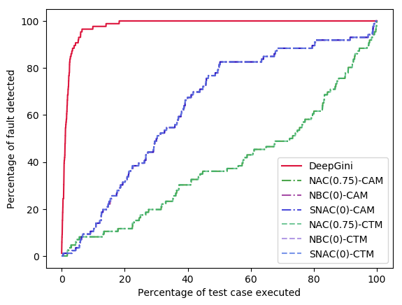
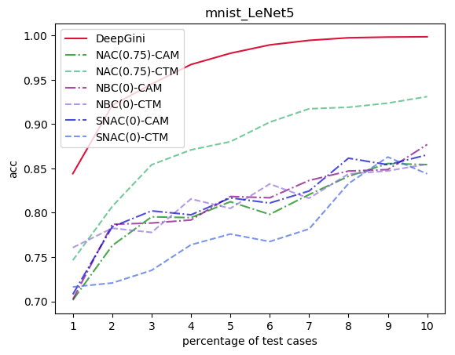
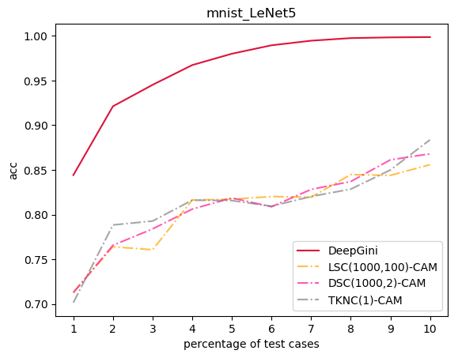

# DeepGINI

DeepGINI is a test data sorting technology for deep learning. This warehouse is the experimental code of DeepGINI.

------

## How to run the code

```
scikit-learn>=0.19.0
keras>=2.3.1
pandas>=0.23.4
numpy>=1.18.0
tensorflow>=1.13.1
tqdm>=4.23.0
foolbox==1.7.0
```

```
conda install -c fragcolor cuda10.0
conda install cudatoolkit==10.0.130
conda install cudnn==7.6.0

pip install tensorflow-gpu==1.13.1 
pip install keras==2.3.1
pip install numpy==1.18.0
pip install scipy==1.4.1
conda install pandas
conda install scikit-learn
pip install --upgrade foolbox==1.7.0
conda install tqdm
```


------

## File code structure

`exp_apfd` is a folder contains the experiment of apfd

`exp_retrain` is a folder contains the experiment of retrain

`init`  is a folder contains the initialization of models and adv examples

`metrics.py` is a file that sorts the samples using different overlay methods.

`model_conf.py`  is a file that records model configuration

`SVNH_DatasetUtil.py` is a file  used to  load svnh data

------

## Data file structure

This data contains 5 folders,`data`,`fashion-mnist`,`model`,`adv_image`,`all_output`.
The data we use are mnist dataset, svhn dataset, fashion dataset, cifar10 dataset.

`data`:This folder mainly contains training data and test data of the svhn data set.

`model`:This folder mainly contains the four models we trained in the experiment. The model uses tensorflow as the calculation graph engine and is trained by keras.

`adv_image`:We use fgsm, jsma, cw, and bim to generate a adversarial sample for the corresponding dataset. The data structure is ndarray in numpy, which is stored as .npy file using python's pickle method.

`

## Experimental result

##### apfd




##### retrain 





